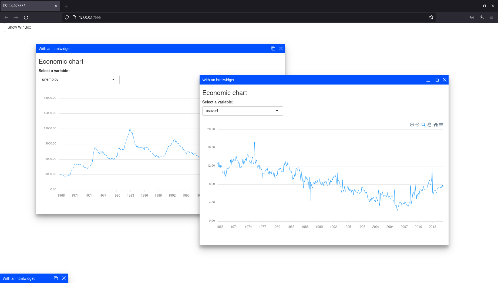

# shinywb

<!-- badges: start -->
[](https://lifecycle.r-lib.org/articles/stages.html#experimental)
[](https://github.com/dreamRs/shinywb/actions)
<!-- badges: end -->

> Interface to [WinBox](https://nextapps-de.github.io/winbox/) JavaScript library to use in [shiny](https://shiny.rstudio.com/) applications. WinBox is a modern HTML5 window manager for the web.

## Installation

You can install the development version of shinywb from [GitHub](https://github.com/) with:

``` r
# install.packages("remotes")
remotes::install_github("dreamRs/shinywb")
```

## Example

Create window from your `server` function with `WinBox()` :

```r
library(shiny)
library(shinywb)
library(apexcharter)
library(ggplot2)
data("economics", package = "ggplot2")

ui <- fluidPage(
  html_dependency_winbox(),
  actionButton(inputId = "show", label = "Show WinBox")
)

server <- function(input, output, session) {

  observeEvent(input$show, {
    inputId <- paste0("var", input$show)
    WinBox(
      title = "With an htmlwidget",
      ui = tagList(
        tags$h3("Economic chart"),
        selectInput(inputId, "Select a variable:", names(economics)[-1]),
        renderApexchart({
          apex(
            data = economics, 
            type = "line", 
            mapping = aes(x = date, y = !!sym(input[[inputId]]))
          ) %>%
            ax_stroke(width = 1)
        })
      ),
      options = wbOptions(height = 630)
    )
  })

}

if (interactive())
  shinyApp(ui, server)
```


